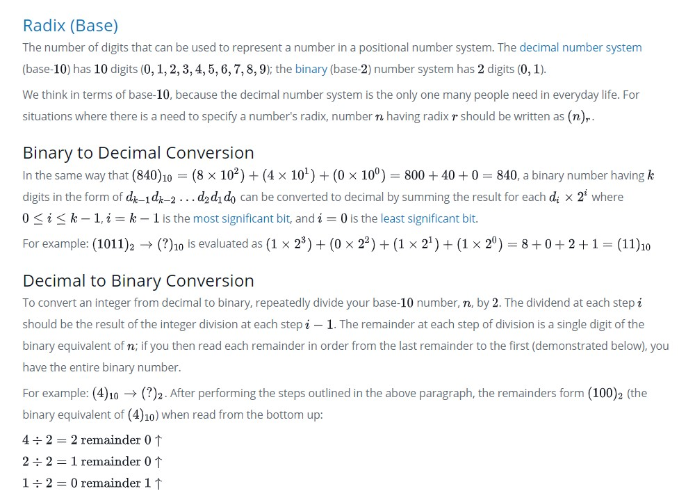

# Decimal to Binary Integer, longest sequence of 1's in binary format.  

#### image worked.  

\-\-\-  

This can be expressed in pseudocode as:

while(n > 0):
    remainder = n%2;
    n = n/2;
    Insert remainder to front of a list or push onto a stack

Print list or stack
Many languages have built-in functions for converting numbers from decimal to binary. To convert an integer, , from decimal to a String of binary numbers in Java, you can use the Integer.toBinaryString(n) function.

Note: The algorithm discussed here is for converting integers; converting fractional numbers is a similar (but different) process.

The binary representation of 5 (dec) in binary is 101 (bi), so the maximum number of consecutive 1's is 1.
The binary representation of 13 (dec) in binary is 1101 (bi), so the maximum number of consecutive 1's is 2.  

